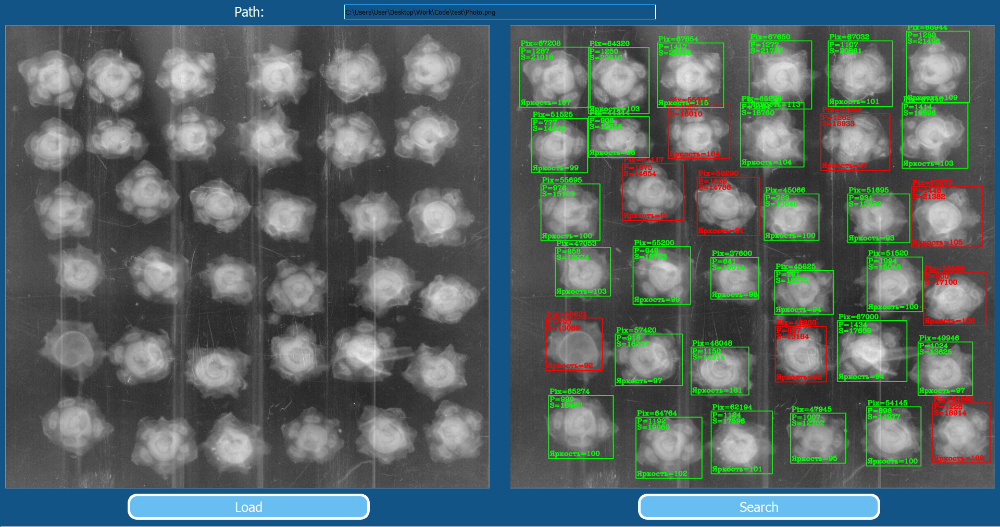
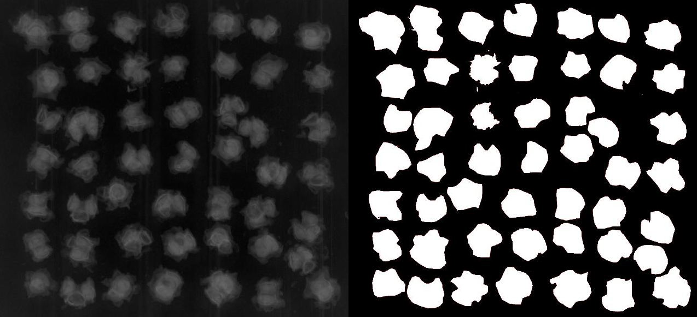
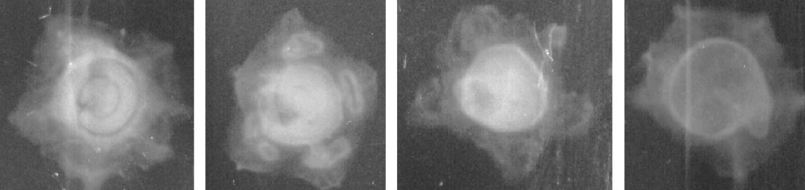
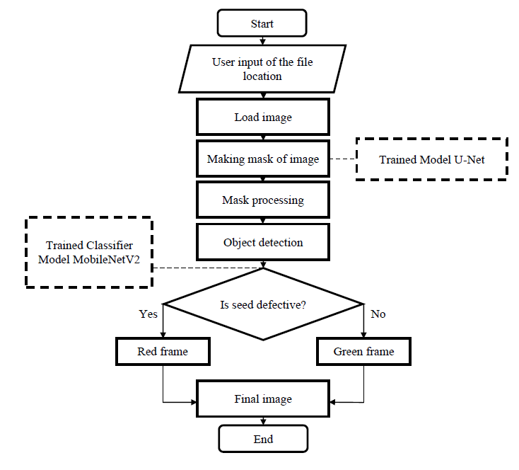

# X-Ray Seed Defect Detection System on CNN

This repository contains the software implementation of a computer vision system for automatic defect detection in X-ray images of seeds.

The system combines semantic segmentation and image classification to identify individual seeds and determine whether each seed is healthy or defective.

  

  <em>Figure 1 - Application for detecting defect seeds</em>

The project was developed as part of my Bachelor’s thesis:

**«Creation and Software Implementation of Specialized Algorithms for Defects Detection on X-Ray Images of Seeds»**

It can be applied in:

- agriculture quality control

- industrial inspection

- automated defect detection systems

# Pipeline of application

1) Segmentation (through U-Net)

    * Input: X-ray image of seeds

    * Output: binary **mask** with seed contours
  
   

     
   

   
   

     <em>Figure 2 - Original picture / Mask of seeds generated by U-Net</em>
   

2) Contour Processing & Instance Extraction

    * Contours are detected, filled, and converted into individual seed regions.

    * Each seed is cropped and prepared for classification.
  
   

     
   

   
   

     <em>Figure 3 - Cropped seeds</em>
   

3) Classification (MobileNetV2)

    - Each extracted seed is classified as:

        ✅ Healthy

        ❌ Defective

4) Visualization

    * The final image is displayed with bounding boxes:

        🟢 Green — healthy seed

         

           
         

   
         

           <em>Figure 4 - Classified seed</em>
         

        🔴 Red — defective seed

# Flowchart

   

<em>Figure 5 - Flowchart of application</em>

# Frameworks

* TensorFlow / Keras

* MONAI

* NumPy

* OpenCV

* PIL

* PyQt

# Results 

- Automated detection of defective seeds on X-ray images

- End-to-end pipeline from raw image to visualized classification

- Modular architecture that allows replacing or improving models

# Outcome

This project demonstrates my practical experience in:

- Computer Vision and Deep Learning (train/validation)

- Designing multi-stage ML pipelines

- Model integration into real applications

- Image processing and post-processing algorithms

- Engineering-oriented ML development

# Project structure

utils.py     - creating directories for files

processor.py            - finding contours on image and cropping function

main.py - initialisation of applicaton

gui.py - outlook of the application

classifier.py  - classificator (pre-trained model)

UNET/ - pre-trained model for segmentation

test/ - images for testing

segmentation/ 

loader.py - load images

model.py - model for segmentation

postprocess.py - post-edit of generated mask

service.py - initialisation of segmentation process

Model_of_Classificator/ - pre-trained model for classification

data/classification/unknown - storage for classification cropped images

